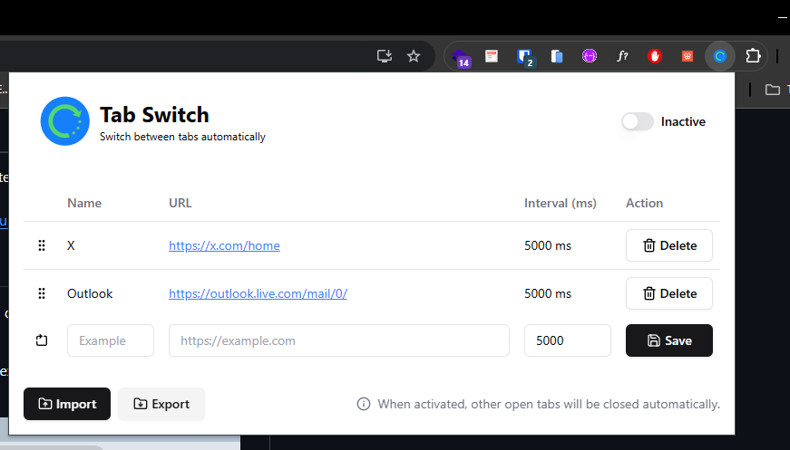

<div align='center'>
    
    <h2 align='center' style={{margin: 0}}>Tab Switch</h2>
    <p align='center'>
        
    </p>
</div>

## 📖 Sobre o projeto

Tab Switch é uma extensão de navegador que permite a rotação automática entre abas abertas, fechando outras abas não configuradas. Ideal para apresentações, monitoramento de dashboards e outras situações onde a rotação de abas é necessária.

## 🛠️ Funcionalidades

- [x] Configuração de tempo de rotação entre abas
- [x] Configuração de abas a serem exibidas
- [x] Importação e exportação de configurações de abas

## 📸 Screenshot

 

## 🚀 Tecnologias Utilizadas

- [React](https://reactjs.org/) - Biblioteca JavaScript para criar interfaces de usuário
- [TypeScript](https://www.typescriptlang.org/) - Superset JavaScript
- [Vite](https://vitejs.dev/) - Build tool para aplicações web modernas
- [Tailwind CSS](https://tailwindcss.com/) - Framework CSS utilitário de baixo nível para construir designs personalizados
- [Lucide Icons](https://lucide.dev/) - Conjunto de ícones para projetos web
- [Biome](https://biomejs.dev/) - Linter e formatador de código rápido e unificado
- [Lefthook](https://github.com/evilmartians/lefthook) - Git hooks manager para garantir qualidade de código

## 📦 Instalação 

1. Clone o repositório:
    ```sh
    git clone git@github.com:RanielliMontagna/tab-switch.git
    cd tab-switch
    ```
2. Instale as dependências:
    ```sh
    pnpm install
    ```
3. Compile o projeto:
    ```sh
    pnpm build
    ```
4. (Opcional) Instale os git hooks para garantir qualidade de código:
    ```sh
    pnpm prepare
    ```
    Isso configurará o Lefthook para executar verificações automáticas antes de commits e pushes.
5. Adicione a extensão no Chrome:
    1. Abra o Chrome e vá para `chrome://extensions/`.
    2. Ative o "Modo do desenvolvedor" no canto superior direito.
    3. Clique em "Carregar sem compactação" e selecione a pasta `build` gerada pelo comando de build.

Agora a extensão está instalada e pronta para uso no Chrome.

## 🔧 Scripts Disponíveis

- `pnpm dev` - Inicia o servidor de desenvolvimento
- `pnpm build` - Compila o projeto para produção
- `pnpm check` - Executa verificação de lint e formatação (Biome)
- `pnpm check:fix` - Executa verificação e corrige automaticamente
- `pnpm lint` - Executa apenas o linter
- `pnpm format` - Formata o código

## 📁 Estrutura do Projeto

```
tab-switch/
├── src/
│   ├── @types/          # Definições de tipos TypeScript
│   │   ├── chrome.d.ts  # Tipos do Chrome Extension API
│   │   └── messages.ts  # Tipos de mensagens entre popup e background
│   ├── assets/          # Assets estáticos (imagens, SVGs)
│   ├── components/      # Componentes React reutilizáveis
│   │   ├── ui/          # Componentes de UI base (Button, Input, etc.)
│   │   └── ErrorBoundary.tsx
│   ├── constants/       # Constantes da aplicação
│   ├── containers/      # Containers/páginas principais
│   │   └── home/        # Container principal da extensão
│   ├── hooks/           # Custom hooks React
│   ├── libs/            # Bibliotecas e utilitários principais
│   │   ├── i18n.ts      # Configuração de internacionalização
│   │   ├── migrations.ts # Migrações de dados
│   │   └── storage.ts   # Utilitários de armazenamento
│   ├── styles/          # Estilos globais
│   ├── utils/           # Funções utilitárias
│   ├── app.tsx          # Componente raiz da aplicação
│   ├── background.ts    # Service worker (background script)
│   └── main.tsx         # Ponto de entrada da aplicação
├── public/              # Arquivos públicos
│   ├── locales/         # Arquivos de tradução (i18n)
│   └── manifest.json    # Manifest da extensão Chrome
├── build/               # Build de produção (gerado)
└── package.json
```

## 🤝 Contribuindo

Contribuições são bem-vindas! Siga estes passos para contribuir:

### 1. Fork e Clone

```sh
# Fork o repositório no GitHub, depois:
git clone git@github.com:SEU_USUARIO/tab-switch.git
cd tab-switch
```

### 2. Instale as Dependências

```sh
pnpm install
```

### 3. Configure os Git Hooks

```sh
pnpm prepare
```

Isso instala o Lefthook que garante qualidade de código antes de commits.

### 4. Crie uma Branch

```sh
git checkout -b feature/minha-feature
# ou
git checkout -b fix/minha-correcao
```

### 5. Faça suas Alterações

- Siga os padrões de código do projeto (Biome será executado automaticamente)
- Adicione testes se possível
- Atualize a documentação se necessário
- Certifique-se de que o build passa: `pnpm build`

### 6. Commit suas Alterações

O Lefthook executará automaticamente:
- Verificação de lint e formatação (Biome)
- Verificação de tipos TypeScript

```sh
git add .
git commit -m "feat: adiciona nova funcionalidade"
# ou
git commit -m "fix: corrige bug específico"
```

### 7. Push e Crie um Pull Request

```sh
git push origin feature/minha-feature
```

Depois, crie um Pull Request no GitHub.

### Padrões de Código

- **TypeScript**: Use tipos explícitos, evite `any`
- **Biome**: O projeto usa Biome para lint e formatação
- **Commits**: Siga o padrão [Conventional Commits](https://www.conventionalcommits.org/)
  - `feat:` para novas funcionalidades
  - `fix:` para correções de bugs
  - `docs:` para documentação
  - `style:` para formatação
  - `refactor:` para refatorações
  - `test:` para testes
  - `chore:` para tarefas de manutenção

## 🐛 Troubleshooting

### Problemas Comuns

#### Build falha com erros de TypeScript

```sh
# Limpe o cache e reconstrua
rm -rf node_modules build
pnpm install
pnpm build
```

#### Extensão não carrega no Chrome

1. Verifique se o build foi executado: `pnpm build`
2. Certifique-se de estar carregando a pasta `build`, não `src`
3. Verifique o console do Chrome (`chrome://extensions/` → Detalhes → Erros)
4. Verifique o console do background script (Service Worker)

#### Erros de permissões

Se a extensão não conseguir criar/gerenciar abas:

1. Verifique o `manifest.json` - deve ter a permissão `tabs`
2. Recarregue a extensão no Chrome
3. Verifique se não há outras extensões conflitantes

#### Problemas com i18n (traduções)

Se as traduções não aparecem:

1. Verifique se os arquivos em `public/locales/` estão corretos
2. Verifique o console do navegador para erros de carregamento
3. Certifique-se de que o build copiou os arquivos de locale para `build/locales/`

#### Erros de storage

Se houver problemas com armazenamento:

1. Abra o DevTools da extensão
2. Vá para Application → Storage → Chrome Extension Storage
3. Verifique se há dados corrompidos
4. Limpe o storage se necessário: `chrome.storage.local.clear()`

### Debugging

#### Debug do Popup

1. Abra a extensão (clique no ícone)
2. Clique com botão direito no popup → "Inspecionar"
3. Use o DevTools normalmente

#### Debug do Background Script

1. Vá para `chrome://extensions/`
2. Encontre a extensão
3. Clique em "Service Worker" (ou "Background page")
4. Isso abrirá o DevTools do service worker

#### Logs

- O projeto usa `console.log` e `console.error` para logging
- Verifique o console do background script para logs de rotação
- Verifique o console do popup para logs da UI

### Desenvolvimento

#### Modo de Desenvolvimento

```sh
pnpm dev
```

Isso inicia o servidor Vite em modo watch. Para ver mudanças na extensão:

1. Execute `pnpm build` após fazer alterações
2. Recarregue a extensão no Chrome (`chrome://extensions/` → ícone de recarregar)

#### Hot Reload

O Vite não suporta hot reload direto para extensões Chrome. Você precisa:

1. Fazer alterações no código
2. Executar `pnpm build`
3. Recarregar a extensão manualmente

#### Verificar Tipos

```sh
pnpm tsc --noEmit
```

#### Verificar Lint

```sh
pnpm check
```

#### Corrigir Problemas de Formatação

```sh
pnpm check:fix
```

## 📦 Versionamento

Este projeto usa [Semantic Versioning](https://semver.org/) e [release-please](https://github.com/googleapis/release-please) para gerenciamento automático de versões.

### Como Funciona

- **Commits convencionais**: Os commits devem seguir o padrão [Conventional Commits](https://www.conventionalcommits.org/):
  - `feat:` - Nova funcionalidade (incrementa versão minor)
  - `fix:` - Correção de bug (incrementa versão patch)
  - `feat!:` ou `fix!:` - Breaking change (incrementa versão major)
  - `docs:`, `style:`, `refactor:`, `perf:`, `test:`, `chore:` - Não incrementam versão

- **Release automático**: O GitHub Actions executa o release-please que:
  - Analisa os commits desde a última release
  - Cria um Pull Request com atualizações de versão e CHANGELOG
  - Quando o PR é mergeado, cria automaticamente uma release e tag

### Processo de Release

1. Faça commits seguindo o padrão Conventional Commits
2. O release-please criará automaticamente um PR com as mudanças
3. Revise e merge o PR
4. A release será criada automaticamente no GitHub

### CHANGELOG

O arquivo `CHANGELOG.md` é atualizado automaticamente pelo release-please baseado nos commits.

## 📝 Licença

Este projeto está licenciado sob a Licença MIT - consulte o arquivo [LICENSE](LICENSE) para obter detalhes.

---

#### 🖊️ Autor - [@raniellimontagna](https://www.github.com/raniellimontagna)